# Documentación Fase 1 - AlChilazo


# Integrantes

| Carné | Nombre |
| --- | --- |
| 202004816 | Kevin Steve Martinez Lemus |
| 202001534 | Erwin Fernando Vásquez Peñate |
| 202000119 | Sergie Daniel Arizandieta Yol |
| 201213498 | Oscar Augusto Perez Tzunun |
| 201608315 | Jesus Fernando Galicia Lima |


# Logo


# Modelo de branching utilizado

Para la realización de la aplicación se utilizó el modelo de branching “Gitflow”, dado que es un modelo bastante intuitivo y ordenado, lo que facilita su implementación en soluciones grandes.

En Gitflow, se utilizan diferentes ramas para organizar y gestionar las distintas etapas del desarrollo. Estas son las ramas principales utilizadas en Gitflow:

- **Rama principal (master o main):** Esta rama representa la versión estable del código y contiene únicamente el código que ha sido probado y aprobado para su implementación en producción. Las versiones del software se etiquetan en esta rama.
- **Rama de desarrollo (develop):** Esta rama es la base principal para el desarrollo. Se crea a partir de la rama principal y es utilizada por los desarrolladores para agregar nuevas características y corregir errores. Una vez que se considera que el código en esta rama está listo para una nueva versión, se fusiona con la rama principal.

Además de estas ramas principales, Gitflow utiliza ramas auxiliares para gestionar características, versiones y correcciones de errores:

- **Ramas de características (feature branches):** Se crean a partir de la rama de desarrollo y se utilizan para desarrollar nuevas características o mejoras en el software. Una vez completadas, se fusionan de nuevo con la rama de desarrollo.
- **Ramas de publicación (release branches):** Se crean a partir de la rama de desarrollo cuando se está preparando una nueva versión del software para su lanzamiento. En esta rama, se realizan las pruebas finales, se corrigen errores menores y se prepara la versión para su implementación en producción. Una vez finalizada, se fusiona tanto con la rama principal como con la rama de desarrollo.
- **Ramas de corrección de errores (hotfix branches):** Se crean a partir de la rama principal en caso de que surja un error crítico en producción que requiera una corrección inmediata. Estas ramas permiten solucionar el problema de forma aislada y luego se fusionan tanto con la rama principal como con la rama de desarrollo.

# Glosario

```
**Backlog:** Es una lista prioritizada de todos los requisitos, funcionalidades, mejoras y 
         elementos de trabajo necesarios para completar un proyecto. Es una parte 
         fundamental de la metodología ágil Scrum.

**Gitflow:** GitFlow es un modelo de flujo de trabajo (workflow) para el control de versiones
         con el sistema de control de versiones Git. y se ha convertido en una metodología 
         comúnmente utilizada en el desarrollo de software.

**Rama:** Es una línea independiente de desarrollo que permite a los desarrolladores trabajar
      en paralelo sin afectar la rama principal del proyecto, generalmente llamada "master"
      o "main". Cada rama en Git representa una secuencia de confirmaciones (commits) que 
      registran los cambios realizados en los archivos del proyecto.

**Scrum:** Scrum es un marco de trabajo ágil utilizado en el desarrollo de software y otros 
       proyectos que requieren flexibilidad y adaptabilidad. Fue creado originalmente 
       para gestionar proyectos de desarrollo de software, pero se ha extendido a otras
       áreas y sectores.

**Sprint:** Un sprint es un período de tiempo fijo y corto durante el cual se realiza el trabajo en un 
        proyecto. Es la unidad básica de tiempo en Scrum y generalmente tiene una duración de
        1 a 4 semanas, aunque puede variar dependiendo del equipo y del proyecto.
```

# Mockups

- Landing Page

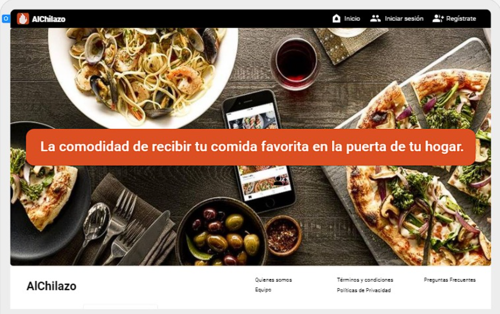
- Inicio de sesión

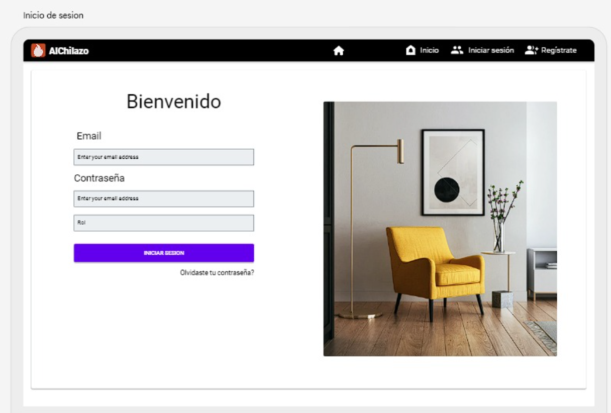

- Registro de usuarios

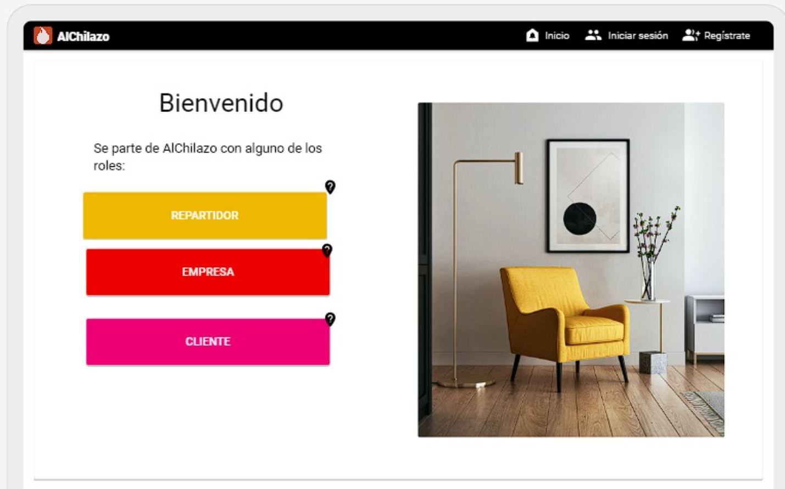

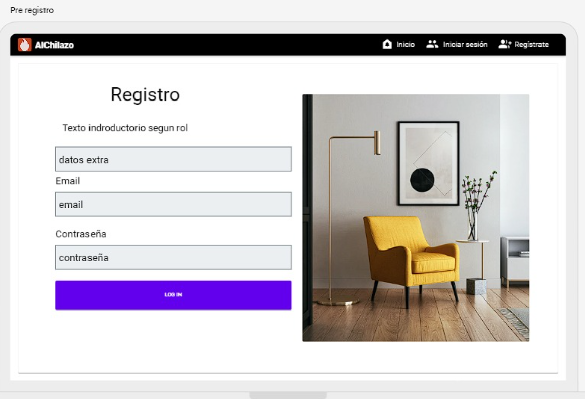

- Aprobar/Rechazar solicitudes

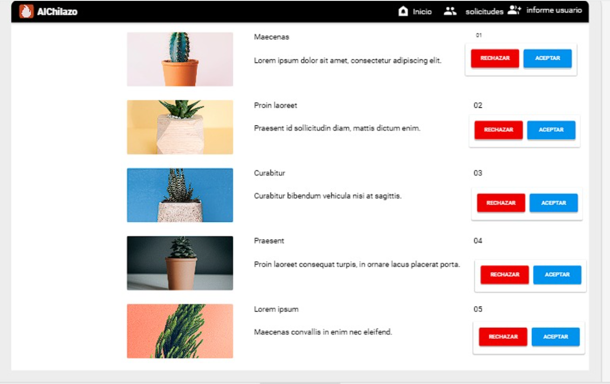

- Dashboard Principal (Perfil)

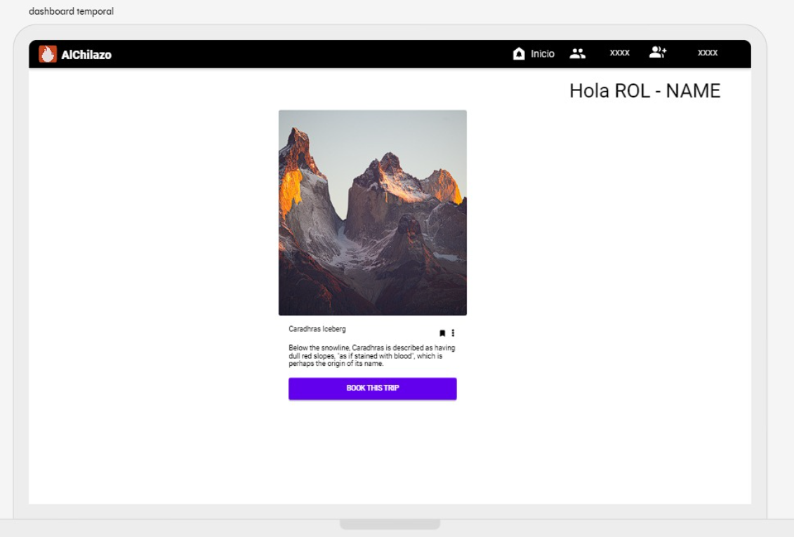


Reportes Administrador
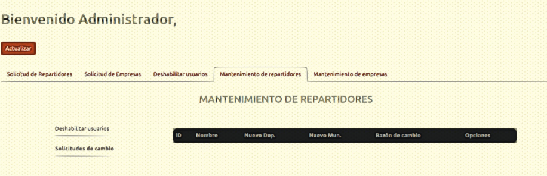

Top 5
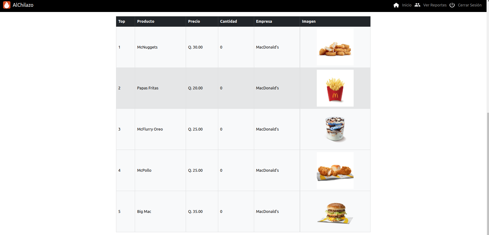


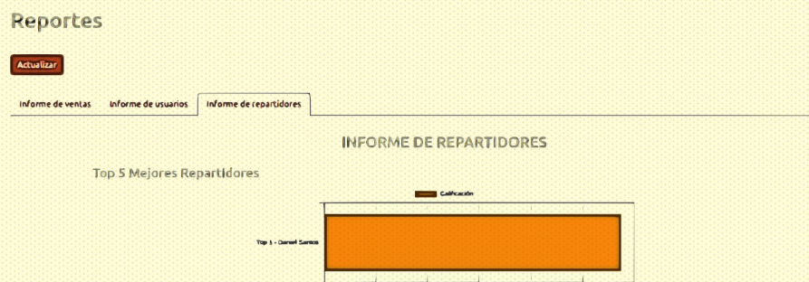


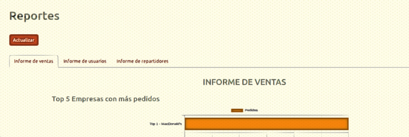


Listar ordenes recibidas - Empresa
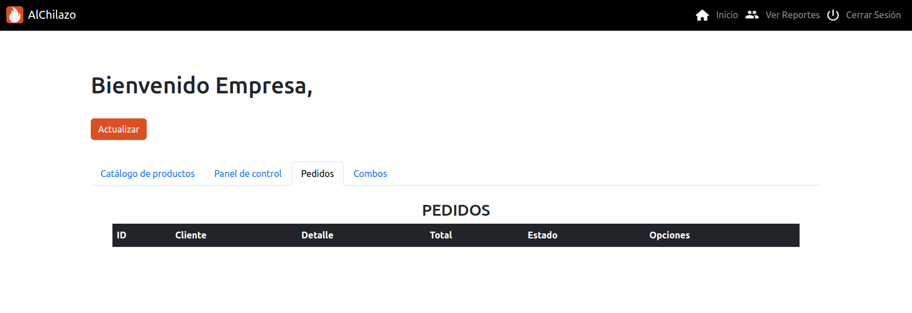

top producto - Empresa
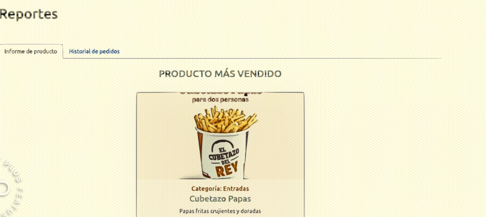

historial de pedidos - Empresa
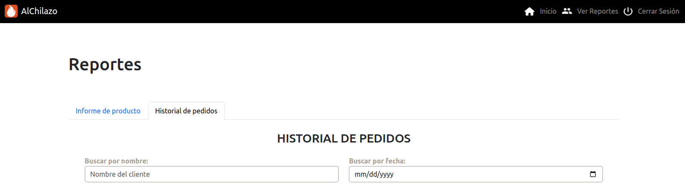

calificacion - Repartidor
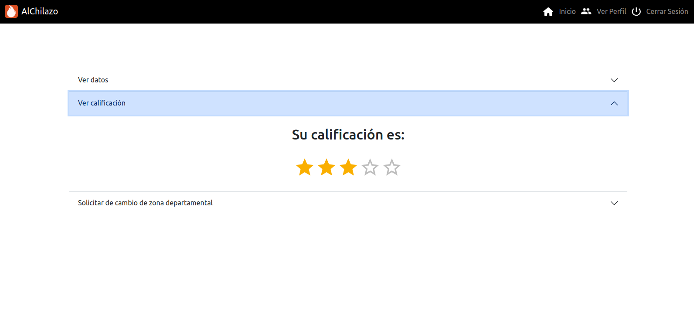

Cambiar direccion - Repartidor
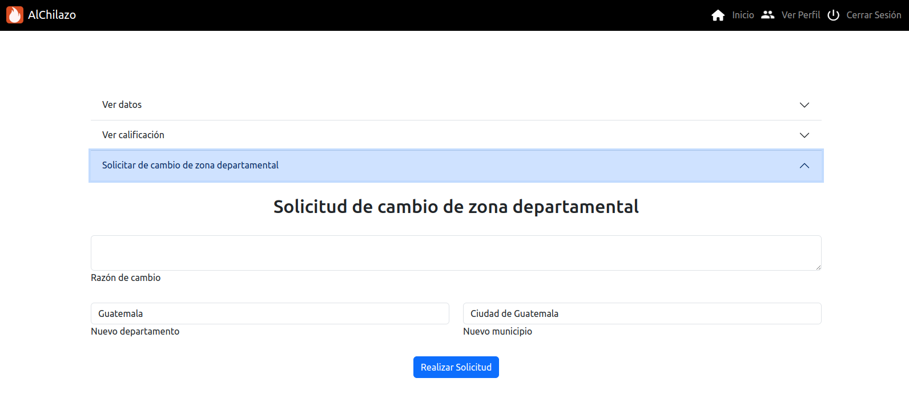

Historial de ordenes - Repartidor
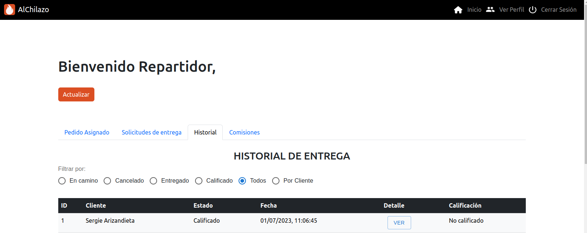


# Tecnologías usadas
## Frontend:
Para el desarrollo del frontend de la aplicación web, hemos utilizado React. React es una biblioteca de JavaScript ampliamente utilizada y respaldada por Facebook. Su enfoque en componentes reutilizables y su capacidad para actualizar de manera eficiente la interfaz de usuario hacen de React una elección ideal para aplicaciones web interactivas y receptivas.


## Backend:
En cuanto al backend de la aplicación, hemos utilizado Node.js. Node.js es un entorno de ejecución de JavaScript basado en el motor V8 de Google Chrome. Gracias a su arquitectura de un solo subproceso y su capacidad para manejar solicitudes de forma asincrónica, Node.js ofrece un rendimiento óptimo y escalabilidad para aplicaciones web de alta carga.

## Base de datos:
Para almacenar y gestionar los datos de la aplicación, hemos utilizado Amazon RDS en conjunto con MySQL. RDS (Amazon Relational Database Service) es un servicio de bases de datos relacionales totalmente administrado proporcionado por Amazon Web Services (AWS). MySQL, por su parte, es un sistema de gestión de bases de datos relacional ampliamente utilizado y confiable. La combinación de RDS y MySQL nos brinda una solución robusta y escalable para la persistencia de datos en nuestra aplicación.

## Bucket S3:
Además, hemos aprovechado el servicio de almacenamiento en la nube de AWS llamado Amazon S3 (Simple Storage Service) para guardar los archivos PDF e imágenes generados o utilizados en la aplicación. Los buckets de S3 proporcionan un almacenamiento seguro, escalable y duradero para los datos de la aplicación, permitiendo un acceso rápido y confiable a los archivos multimedia.

## Resumen de tecnologías:
La aplicación web "AlChilado" ha sido desarrollada utilizando React para el frontend, Node.js para el backend, Amazon RDS con MySQL para la base de datos, y Amazon S3 para el almacenamiento de archivos PDF e imágenes. Estas tecnologías han sido seleccionadas cuidadosamente para proporcionar un rendimiento óptimo, escalabilidad y seguridad en la aplicación.

Por el momento el frontend y el backen solo se han utilizado de forma local debido a su constates modificaciones para esta primer fase y por temas de escalabilidad se implementaron los servicios de AWS que se mencionaron para que sea más accesible para todos trabajar con los mismos datos.

# Arquitectura
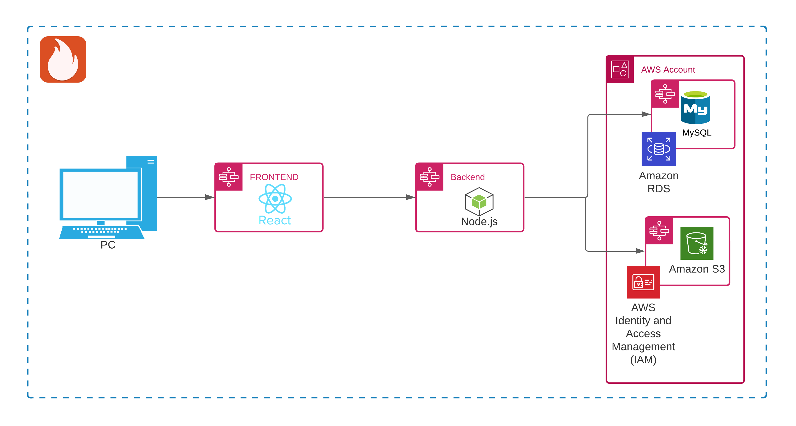

# Modelo Entidad Relación

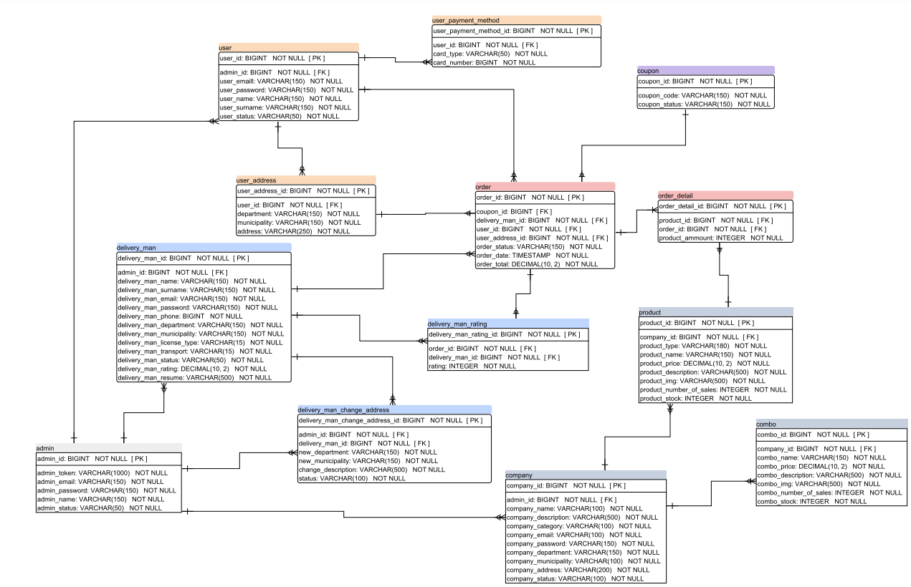


# Diagrama de despliegue


# Casos de uso

Los casos de uso son una técnica para especificar el comportamiento de un sistema: “Un caso de uso es una secuencia de interacciones entre un sistema y actores que usan alguno de sus servicios".


# User Story Map


## Casos de uso de alto nivel en AlChilazo

```
**Caso de uso:** Inicio de sesión
**Actores:** Administrador, Repartidor, Cliente y Empresa
**Tipo:** Primario
**Descripción:** Los involucrados podrán acceder al sistema mediante un módulo de autenticación,
que les permita acceder a su módulo correspondiente si se encuentran coincidencias de credenciales.
```

```
**Caso de uso:** Registrar Cliente
**Actores:** Cliente
**Tipo:** Primario
**Descripción:** El cliente puede registrarse en el sistema, llenando todos sus datos personales
para su posteriror uso,el sistema comprueba que el cliente no este registrado con anterioridad.
```

```
**Caso de uso:** Registrar Repartidor
**Actores:** Repartidor
**Tipo:** Primario
**Descripción:** El repartidor puede registrarse en el sistema, llenando todos sus datos y pasando
por las validaciones de la información que proporciona, el sistema comprueba que el repartidor
no este registrado con anterioridad.
```

```
**Caso de uso:** Registrar Empresa
**Actores:** Empresa
**Tipo:** Primario
**Descripción:** La empresa ****puede registrarse en el sistema, llenando todos sus datos y pasando
por las validaciones de la información que proporciona, el sistema comprueba que la empresa
no este registrado con anterioridad para poder registrarse y ofrecer sus productos y servicios.
```

```
**Caso de uso:** Ver mi perfil (Repartidor)
**Actores:** Repartidor
**Tipo:** Primario
**Descripción:** El repartidor puede acceder a un apartado para visualizar sus datos de perfil,
incluidas sus calificaciones.
```

```
**Caso de uso:** Registrar productos y combos
**Actores:** Empresa
**Tipo:** Primario
**Descripción:** La empresa puede registrar nuevos productos y combos para ofrecer a los clientes,
además podrá agregar información que detalle el proudcto.
```

## Casos de uso expandidos en AlChilazo

```
**Caso de uso:** Inicio de sesión
**Actores:** Administrador, Repartidor, Cliente y Empresa
**Tipo:** Primario
**Descripción:** Los involucrados podrán acceder al sistema mediante un módulo de autenticación,
que les permita acceder a su módulo correspondiente si se encuentran coincidencias de credenciales.
**Curso normal de los eventos:**
	 1. El usuario se dirige al módulo de inicio de sesión.
	 2. El usuario ingresa sus credenciales.
    3. El usuario ingresa al sistema.
**Cursos alternos:**
	 1. El usuario recibe una notificación que le indica credenciales incorrectas, para
			que intente de nuevo.
```

```
**Caso de uso:** Registrar Cliente
**Actores:** Cliente
**Tipo:** Primario
**Descripción:** El cliente puede registrarse en el sistema, llenando todos sus datos personales
para su posteriror uso,el sistema comprueba que el cliente no este registrado con anterioridad.
**Curso normal de los eventos:**
	 1. El cliente se dirige al módulo de registro de clientes.
	 2. El cliente ingresa sus datos, con los que se quiere registrar.
    3. El sistema busca que no existan coincidencias de datos al querer registrarse.
    4. El sistema notifica que el cliente se ha registrado satisfactoriamente.
**Cursos alternos:**
	 1. El sistema notifica que ya existe un cliente con la misma dirección de correo eléctronico
      registrado en el sistema.
```

```
**Caso de uso:** Registrar Repartidor
**Actores:** Repartidor
**Tipo:** Primario
**Descripción:** El repartidor puede registrarse en el sistema, llenando todos sus datos y pasando
por las validaciones de la información que proporciona, el sistema comprueba que el repartidor
no este registrado con anterioridad.
**Curso normal de los eventos:**
	 1. El repartidor se dirige al módulo de registro de repartidores.
	 2. El repartidor ingresa sus datos, con los que se quiere registrar.
   3. El sistema busca que no existan coincidencias de datos al querer registrarse.
   4. El sistema notifica que el repartidor se ha registrado satisfactoriamente, a la
      espera que se apruebe su solicitud por un administrador.
**Cursos alternos:**
	 1. El sistema notifica que ya existe un repartidor con la misma dirección de correo eléctronico
      registrado en el sistema.
```

```
**Caso de uso:** Registrar Empresa
**Actores:** Empresa
**Tipo:** Primario
**Descripción:** La empresa ****puede registrarse en el sistema, llenando todos sus datos y pasando
por las validaciones de la información que proporciona, el sistema comprueba que la empresa
no este registrado con anterioridad para poder registrarse y ofrecer sus productos y servicios.
**Curso normal de los eventos:**
	 1. La empresa se dirige al módulo de registro de empresas.
	 2. La empresa ingresa sus datos, con los que se quiere registrar.
    3. El sistema busca que no existan coincidencias de datos al querer registrarse.
    4. El sistema notifica que la empresa se ha registrado satisfactoriamente, a la
      espera que se apruebe su solicitud por un administrador.
**Cursos alternos:**
	 1. El sistema notifica que ya existe una empresa con la misma dirección de correo eléctronico
      registrada en el sistema.
```

```
**Caso de uso:** Ver mi perfil (Repartidor)
**Actores:** Repartidor
**Tipo:** Primario
**Descripción:** El repartidor puede acceder a un apartado para visualizar sus datos de perfil,
incluidas sus calificaciones.
**Curso normal de los eventos:**
	 1. El repartidor se autentica con sus credenciales en el módulo de inicio de sesión.
	 2. El sistema valida credenciales correctas y que haya sido aprobado por un administrador.
    3. El repartidor inicia sesión satisfactoriamente.
    4. El repartidor puede acceder a su perfil, donde encontrará todos sus datos.
**Cursos alternos:**
	 1. El sistema notifica que el repartidor ingresó credenciales incorrectas.
    2. El sistema notifica que el repartidor aún no ha sido aprobado por un administrador.
```

```
**Caso de uso:** Registrar productos y combos
**Actores:** Empresa
**Tipo:** Primario
**Descripción:** La empresa puede registrar nuevos productos y combos para ofrecer a los clientes,
además podrá agregar información que detalle el proudcto.
**Curso normal de los eventos:**
	 1. La empresa se autentica con sus credenciales en el módulo de inicio de sesión.
	 2. El sistema valida credenciales correctas y que haya sido aprobada por un administrador.
    3. La empresa inicia sesión satisfactoriamente.
    4. La empresa puede registrar productos y combos.
**Cursos alternos:**
	 1. El sistema notifica que la empresa ingresó credenciales incorrectas.
    2. El sistema notifica que la empresa aún no ha sido aprobada por un administrador.
```

# Herramienta de gestión de proyectos

## Jira:
Jira es una herramienta de gestión de proyectos ampliamente utilizada para el desarrollo de software. Permite organizar tareas, hacer un seguimiento del progreso y colaborar en equipos. También ofrece funciones de seguimiento de errores e incidencias. Con tableros visuales y paneles personalizables, facilita la planificación y la toma de decisiones. En resumen, Jira ayuda a los equipos a trabajar de manera más organizada y eficiente en sus proyectos de desarrollo de software.

### Tablero:
[https://alchilazo-ayd1.atlassian.net/jira/software/projects/AL/boards/1](https://alchilazo-ayd1.atlassian.net/jira/software/projects/AL/boards/1)
